# Anexo 1 — Diagrama de flujo del programa

Aplica igual a `screensaver_seq` y `screensaver_par`: comparten todo
`src/common/` y el mismo `run_app()`; la única diferencia es la función
`particles_update()` que se les pasa (loop secuencial vs. `#pragma omp
parallel for`), marcada en el diagrama.

```mermaid
flowchart TD
    A([Inicio: main]) --> B["parse_args(argc, argv)\ncaptura de argumentos"]
    B --> C{"Argumento\nconocido y bien\nformado?"}
    C -- "no (ej. --n abc,\nflag desconocida)" --> D["imprimir error en stderr\n+ print_usage()"]
    D --> Z1([Salir, codigo 1])

    C -- "si" --> E{"Programacion defensiva:\nn>0? width/height >= minimo?\nfps>0? frames>=0? threads>=0?\nbenchmark implica frames>0?"}
    E -- "no cumple" --> D
    E -- "cumple" --> F["Completar defaults\n(seed = time(NULL) si seed==0)"]

    F --> G["Construir SimState inicial\n(width, height, gravity, wind, season)"]
    G --> H["particles_create(n, state, seed)\nreserva memoria + inicializa N particulas"]
    H --> I{"malloc\nfallo?"}
    I -- "si" --> J["imprimir error en stderr"]
    J --> Z2([Salir, codigo 1])

    I -- "no" --> K{"cfg.benchmark?"}

    %% ---- modo benchmark (headless) ----
    K -- "si" --> L["Modo benchmark:\nsin ventana SDL"]
    L --> M["timer_now_seconds() -> start"]
    M --> N["for frame in 0..frames-1"]
    N --> O["state.time_sec = frame * dt"]
    O --> P

    %% ---- modo interactivo ----
    K -- "no" --> Q["SDL_Init + SDL_CreateWindow + SDL_CreateRenderer\n(si falla cualquiera: imprimir error y salir)"]
    Q --> R["dino_create(), obstacles_create()"]
    R --> S["while running"]
    S --> S1["SDL_PollEvent: SDL_QUIT o ESC -> running=false"]
    S1 --> S2["dt = ahora - ultimo frame\n(clamp a 0.05s max)"]
    S2 --> P

    %% ---- seccion paralela compartida (particulas) ----
    subgraph PAR ["Seccion medida / paralelizable"]
    direction TB
    P["particles_update(particles, n, &state, dt)"]
    P --> P1{"Binario seq o par?"}
    P1 -- "seq" --> P2["for i in 0..n-1 (serial)\nparticle_step(&particles[i])"]
    P1 -- "par" --> P3["#pragma omp parallel for\nschedule(static)\nreduction(+:respawned)"]
    P3 --> P4["cada hilo procesa un\nsubconjunto de particulas,\nparticle_step(&particles[i])"]
    P2 --> P5["particle_step: gravedad + viento\nsinusoidal, rebote en bordes,\nrespawn si sale por abajo\n(usa rand_r con estado propio\npor particula, sin lock)"]
    P4 --> P5
    P5 --> P6["Mecanismo de sincronia:\nreduction(+:respawned) suma el\ncontador local de cada hilo\nal salir de la region paralela\n(sin critical/lock explicito)"]
    end

    P6 --> T{"cfg.benchmark?"}
    T -- "si" --> U{"quedan frames?"}
    U -- "si" --> N
    U -- "no" --> V["elapsed = timer_now_seconds() - start"]
    V --> W["Despliegue de resultados (benchmark):\nprintf CSV\nn,threads,frames,elapsed,total_respawns"]
    W --> X1["particles_free(particles)"]
    X1 --> Z3([Fin, codigo 0])

    T -- "no" --> Y1["obstacles_update() + dino_should_jump()\n+ dino_update() (logica de juego, serial)"]
    Y1 --> Y2["scene_palette_at(time_sec, ...)\ncalcula paleta dia/noche + estacion"]
    Y2 --> Y3["Despliegue de resultados (interactivo):\nrender_frame() dibuja cielo, piso,\nparticulas, obstaculos y dino via SDL\n(siempre en el hilo principal)"]
    Y3 --> Y4{"running == false\no frame_count >= frames\n(si frames>0)?"}
    Y4 -- "no" --> S
    Y4 -- "si" --> X2["particles_free() + SDL_DestroyRenderer\n+ SDL_DestroyWindow + SDL_Quit"]
    X2 --> Z4([Fin, codigo 0])
```

## Notas sobre cada bloque clave

- **Captura de argumentos:** `parse_args()` (`src/common/args.c`) recorre
  `argv` a mano (sin `getopt`) y llena un `Config` con defaults antes de
  sobreescribir con lo que venga en la línea de comandos.
- **Solicitud de ingreso de datos:** el programa no pide datos por
  `stdin` en tiempo de ejecución — todos los parámetros (`--n`, `--width`,
  `--height`, `--fps`, `--frames`, `--threads`, `--seed`, `--season`,
  `--benchmark`) se leen de `argv`, que es la forma de "ingreso de datos"
  de una herramienta de línea de comandos.
- **Programación defensiva:** validación de tipos (`strtol` con chequeo
  de `endptr`), rangos (`n>0`, canvas mínimo 640×480, `fps>0`,
  `frames>=0`, `threads>=0`) y una regla cruzada (`--benchmark` exige
  `--frames > 0`); todo antes de reservar memoria o abrir SDL. También se
  revisa el retorno de `malloc` en `particles_create()` y el de cada
  llamada de inicialización de SDL.
- **Secciones paralelas:** únicamente el loop dentro de
  `particles_update()` en `src/par/particle_update.c`. El resto del
  programa (parseo de args, lógica de dino/obstáculos, render SDL) es
  intencionalmente serial.
- **Mecanismos de sincronía:** `reduction(+:respawned)` de OpenMP. Se
  eligió sobre un `critical`/lock porque el contador de partículas
  recicladas es la única escritura compartida entre iteraciones; con
  `reduction` cada hilo lleva su propio acumulador local y OpenMP los
  combina al cerrar la región paralela, sin serializar el loop.
- **Despliegue de resultados:** en modo `--benchmark` es una línea CSV
  por stdout (`n,threads,frames,segundos,particulas_recicladas`); en modo
  interactivo es el frame dibujado con SDL (cielo, piso, partículas, dino,
  obstáculos) en cada iteración del loop principal.
