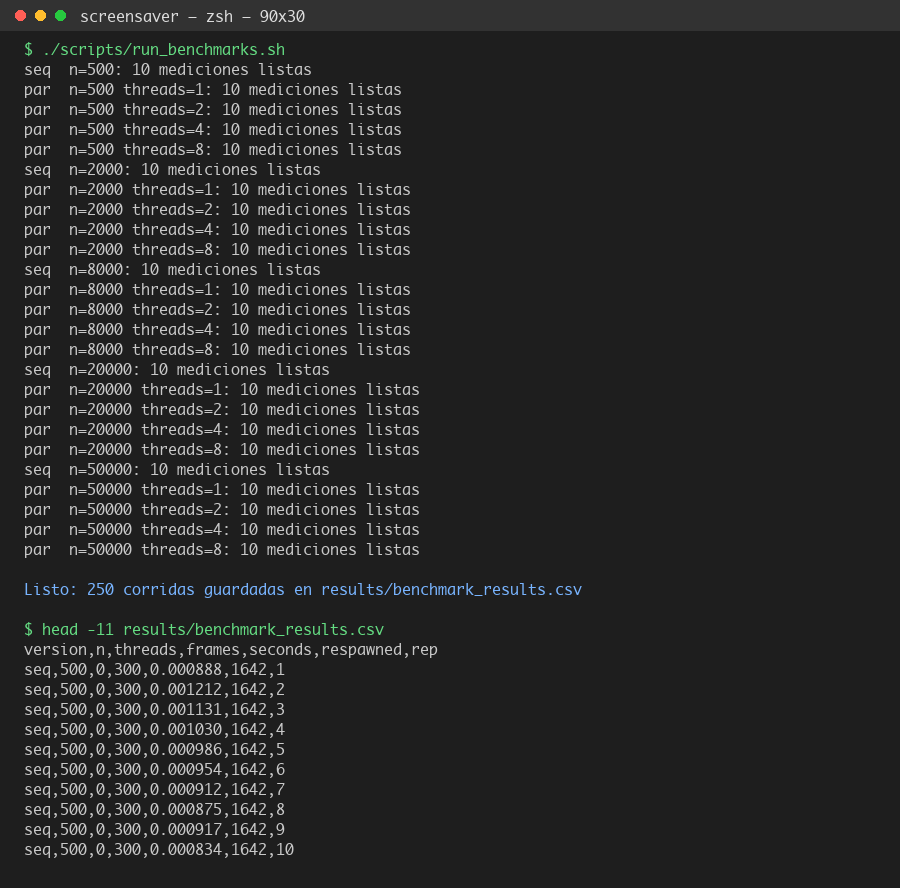
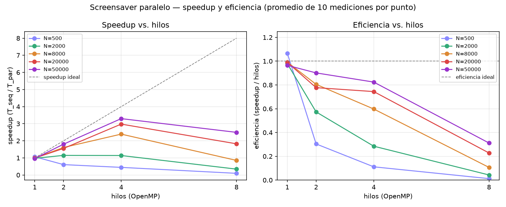

# Anexo 3 — Bitácora de pruebas

## Metodología

Las mediciones se hicieron con `screensaver_seq` y `screensaver_par` en
modo `--benchmark` (sin ventana SDL): cada corrida ejecuta 300 frames del
loop de `particles_update()` y mide el tiempo total con un reloj
monotónico (`clock_gettime(CLOCK_MONOTONIC, ...)`), reportando
`n,threads,frames,segundos,particulas_recicladas`. Este modo aísla
exactamente la sección medida/paralelizada del resto del programa
(render, lógica de dino/obstáculos), que se mantiene fuera de la
medición.

Script usado: `scripts/run_benchmarks.sh`. Combinaciones probadas:

- **N (partículas):** 500, 2000, 8000, 20000, 50000.
- **Hilos (solo versión paralela):** 1, 2, 4, 8.
- **Repeticiones:** 10 por combinación (mínimo exigido por la rúbrica).
- **Máquina:** Apple Silicon, 8 cores lógicos (`sysctl -n hw.ncpu` = 8).

Total: 5 (N) × (1 secuencial + 4 configuraciones paralelas) × 10
repeticiones = **250 mediciones**, guardadas sin editar en
[`results/benchmark_results.csv`](../results/benchmark_results.csv).

## Captura de las mediciones

Corrida real del script y primeras filas del CSV crudo generado:



## Resultados: speedup y eficiencia

Por cada combinación (N, hilos) se promediaron los 10 tiempos medidos.
Speedup = `tiempo_secuencial_promedio / tiempo_paralelo_promedio`.
Eficiencia = `speedup / número_de_hilos`. Cálculo completo en
[`results/benchmark_summary.csv`](../results/benchmark_summary.csv).

| N | hilos | T secuencial (ms) | T paralelo (ms) | Speedup | Eficiencia |
|---:|---:|---:|---:|---:|---:|
| 500 | 1 | 0.974 | 0.913 | 1.07 | 1.07 |
| 500 | 2 | 0.974 | 1.602 | 0.61 | 0.30 |
| 500 | 4 | 0.974 | 2.182 | 0.45 | 0.11 |
| 500 | 8 | 0.974 | 9.921 | 0.10 | 0.01 |
| 2000 | 1 | 3.432 | 3.505 | 0.98 | 0.98 |
| 2000 | 2 | 3.432 | 2.994 | 1.15 | 0.57 |
| 2000 | 4 | 3.432 | 3.011 | 1.14 | 0.29 |
| 2000 | 8 | 3.432 | 9.958 | 0.34 | 0.04 |
| 8000 | 1 | 14.531 | 14.648 | 0.99 | 0.99 |
| 8000 | 2 | 14.531 | 9.025 | 1.61 | 0.81 |
| 8000 | 4 | 14.531 | 6.077 | **2.39** | 0.60 |
| 8000 | 8 | 14.531 | 17.006 | 0.85 | 0.11 |
| 20000 | 1 | 36.819 | 37.195 | 0.99 | 0.99 |
| 20000 | 2 | 36.819 | 23.684 | 1.55 | 0.78 |
| 20000 | 4 | 36.819 | 12.367 | **2.98** | 0.74 |
| 20000 | 8 | 36.819 | 20.182 | 1.82 | 0.23 |
| 50000 | 1 | 93.322 | 96.725 | 0.96 | 0.96 |
| 50000 | 2 | 93.322 | 51.770 | 1.80 | 0.90 |
| 50000 | 4 | 93.322 | 28.305 | **3.30** | 0.82 |
| 50000 | 8 | 93.322 | 37.414 | 2.49 | 0.31 |



## Análisis

- **El speedup crece con N.** Con pocas partículas (N=500) el trabajo
  por hilo es tan pequeño que el overhead de OpenMP de crear/sincronizar
  el equipo de hilos en cada uno de los 300 frames (`fork-join` por
  frame) supera el ahorro — el paralelo termina siendo **más lento** que
  el secuencial (speedup < 1). Con N grande (20000-50000) ese overhead se
  amortiza sobre mucho más trabajo real y el speedup sube claramente,
  llegando a **3.30x con 4 hilos y N=50000**.
- **4 hilos es consistentemente el mejor punto, no 8.** En todos los
  tamaños de N probados, pasar de 4 a 8 hilos *empeora* el tiempo en vez
  de mejorarlo. La causa más probable es la arquitectura del chip (Apple
  Silicon combina núcleos de rendimiento y de eficiencia): al pedir 8
  hilos, OpenMP reparte trabajo también sobre núcleos más lentos y con
  overhead de scheduling del sistema operativo, que no compensa el
  paralelismo extra. Esto también es consistente con la Ley de Amdahl:
  la fracción no paralelizable (overhead fijo de `fork-join` por frame)
  pesa proporcionalmente más cuantos más hilos se agregan si el trabajo
  por hilo se vuelve muy chico.
- **La eficiencia cae con el número de hilos** en todos los casos
  (esperado: el trabajo por partícula es muy poco comparado con el
  overhead de sincronización de OpenMP), pero se mantiene razonable
  (>0.7) en 2 y 4 hilos para N≥8000, que es donde este screensaver
  correría en un caso de uso real (varios miles de partículas de
  clima en pantalla).
- **El resultado de la física no cambia entre versiones.** Las 250
  mediciones de la tabla no usan `--seed` fijo (cada proceso toma
  `time(NULL)` como semilla), así que sus columnas de partículas
  recicladas varían un poco entre repeticiones — eso es esperado y no es
  un error. Para confirmar que paralelizar el loop no introdujo
  condiciones de carrera, se corrió por separado con **semilla fija**
  (`--seed 12345`, N=8000, 300 frames) comparando el conteo de partículas
  recicladas entre binarios y números de hilos:

  ```
  seq            (1 hilo, serial):    26144 particulas recicladas
  par --threads 1:                    26144 particulas recicladas
  par --threads 4:                    26144 particulas recicladas
  par --threads 8:                    26144 particulas recicladas
  ```

  Resultado idéntico en los cuatro casos: `reduction(+:respawned)`
  combina correctamente los contadores locales de cada hilo sin perder
  ni duplicar reciclajes, y la falta de dependencias entre partículas
  significa que el orden en que los hilos las procesan no afecta el
  resultado final.
